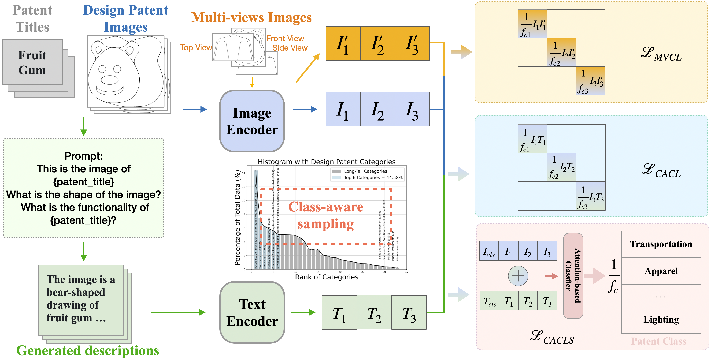

# PATENTCLIP: Multimodal Analyses of Design Patents 
We introduce PATENTCLIP, a multimodal model trained on large-scale design data including all patents from 2007 to 2022.

:black_nib: We incorporate class-aware classification and contrastive learning,
generate detailed captions for patent images and multi-views
image learning.



<!-- ## Data
:green_book: Sample datas can be viewed and download [here](). -->

## PatentCLIP
:fire: PatentCLIP is based on [CLIP](https://github.com/openai/CLIP), and we use an open source [open_clip](https://github.com/mlfoundations/open_clip) implementation and incorporate class-aware classification and contrastive learning.


:hugs: PatentCLIP-ViT-B [checkpoint](https://huggingface.co/patentclip/PatentCLIP_Vit_B)


### Usage
Load a PatentCLIP model:
```
import open_clip

model, _, preprocess = open_clip.create_model_and_transforms('hf-hub:patentclip/PatentCLIP_Vit_B', device=device)
tokenizer = open_clip.get_tokenizer('hf-hub:patentclip/PatentCLIP_Vit_B')
```

### Multimodal retrieval results 

Multimodal retrieval results for Image to Text and Text to image using both CLIP and PATENTCLIP moodels.

|  **Model**  |   **Backbone**   | **Text-Image**  |          | **Image-text**     |          | 
| ----------|  ----------|---------- |  ----------| ---------- |  ---------- | 
|        |        |       **R@5**     | **R@10**    |   **R@5**       |  **R@10** |
|        |    RN50    |       5.47    | 8.51    |   5.24      |  7.72 |
|   CLIP     |    RN101   |       7.60    | 11.17    |   6.10      |  9.35 |
|        |    ViT-B  |     7.49   |10.60  |   6.90      |  10.34|
|        |    ViT-L   |       13.26    | 18.29    |   12.07      |  17.17 |
|        |    RN50    |       25.17   | 34.50    |   23.49      |  32.70|
|   PATENTCLIP     |    RN101   |       26.71   | 36.51    |   25.37      |  34.84 |
|        |    ViT-B  |       29.75  | 39.91    |   28.39      |  38.26|
|        |    ViT-L   |       **41.72**    | **52.55**    |   **39.59**      |  **50.44** |


### Patent Classification

```
python classification.py
```
Classification results (Accuracy (%)) for both CLIP and PATENTCLIP in Zero-shot and Fine-tuned settings. Datasetr used here are from the year 2023.

|**Model** |   **Backbone**   | **Zero-shot**  |  **Fine-tuned**     | 
| ----------|  ----------|---------- |  ----------|
| CLIP| RN101 | 11.91 | 15.47|
| | ViT-B | 10.88 | 38.99|
PATENTCLIP| RN101| 11.93| 29.92|
| | ViT-B | 14.70 | 41.34|

